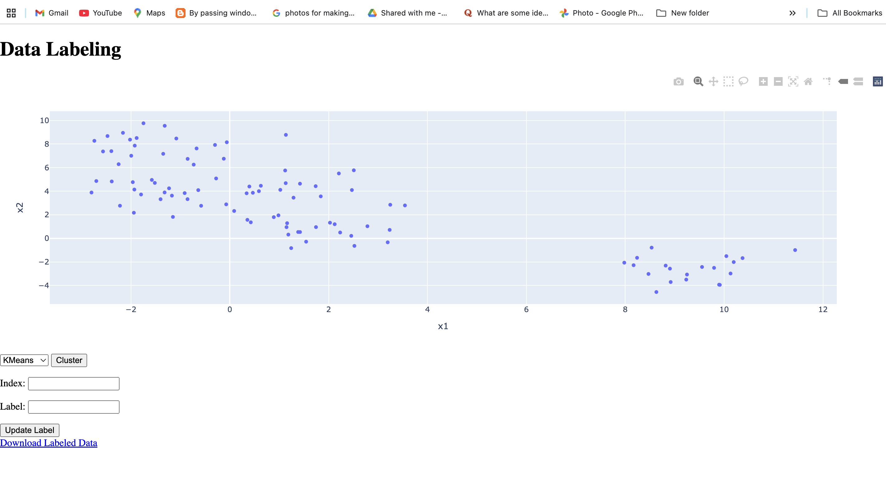
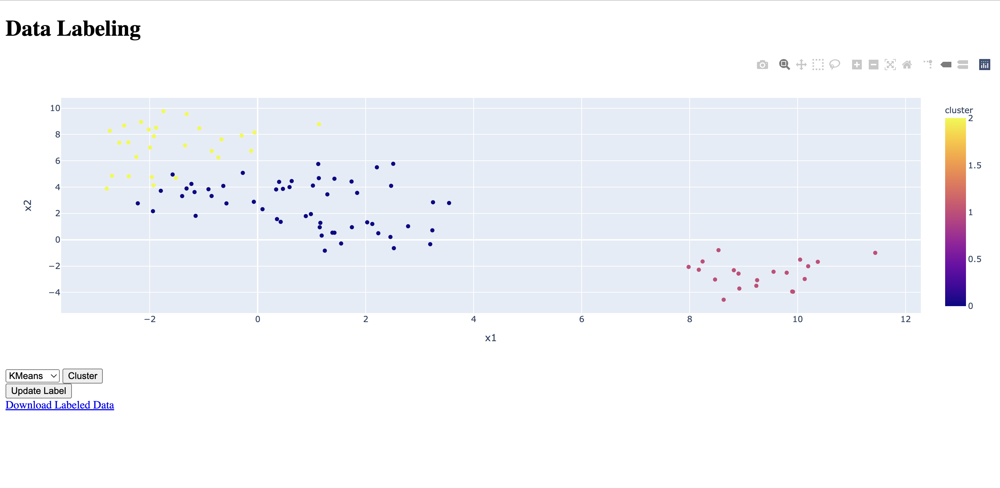

# How to Run the project

- git clone (enter this repo url)
- cd data_labeling_project
- pip install -r requirements.txt
- python manage.py makemigrations
- python manage.py migrate
- python manage.py runserver

# data_labeling_project
This project outlines the requirements for a 2D data labeling tool that will allow users to upload a csv file with 2D data and manually edit labels for selected data points using a GUI. The final output can be exported as a csv file.

**Features:**

- Upload csv data: A file upload functionality that allows users to upload a csv file with 2D data.
- Scatter plot visualization: The data points will be visualized as a scatter plot.
- Rectangular selector: A rectangular selector tool that allows users to select data points in the scatter plot by drawing a rectangle around the desired points.
- Manual label editing: A GUI that includes an input box and submit button for manually editing the labels for selected data points.
- Export to csv: Ability to export the data, along with the manually edited labels, to a csv file.

**Technical Requirements:**

- Web platform: The tool will be built as a single web platform.

- Python libraries (suggestion only): 

    The following libraries can be used to build the tool:

    - Flask or Django for the web framework.
    - Pandas for reading and writing the csv file.
    - Plotly for creating the scatter plot visualization and for implementing the rectangular selector and manual label editing GUI.

**Conclusion:**
The 2D data labeling tool will allow users to easily manually edit labels for selected data points using a GUI. The final output can be exported as a csv file. The tool will be built as a single web platform using a combination of popular Python libraries.

**APP Results**

- Result -1

- Result -2

- Result -3

- Result -4

